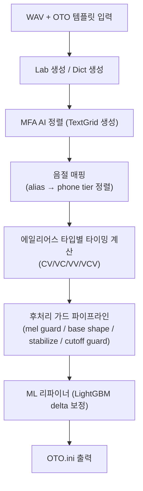

# Auto OTO 품질 향상 분석 보고서

## 현재 아키텍처 요약

현재 파이프라인은 다음 단계로 구성됩니다:



---

## 1. MFA 정렬 정확도 향상 (근본적 품질 기반)

MFA의 TextGrid 정렬은 이후 모든 파라미터의 **기초**입니다. 여기가 부정확하면 하위 보정은 한계가 있습니다.

### 1-1. MFA 프로필 튜닝

현재 [mfa_runner.py](file:///c:/Users/oyh57/SODAsoo1/Devs/UTAU_Auto_OTO_v3/Auto_OTO/core/mfa_runner.py)에서 `beam=320`, `retry_beam=960`으로 고정되어 있습니다. 

> [!TIP]
> - **beam/retry_beam 값을 높이면** 정렬 탐색 공간이 넓어져 어려운 구간의 정확도가 올라갑니다 (대신 속도↓)
> - MFA의 `--fine_tune` 옵션을 활성화하면 음향 모델이 현재 음원에 적응해 정렬이 개선됩니다
> - 현재 `"default"` 프로필은 `fine_tune: True`이지만, 이를 UI에서 선택/제어할 수 있게 하면 좋습니다

### 1-2. SOFA 정렬기 병행 활용

이미 [sofa_runner.py](file:///c:/Users/oyh57/SODAsoo1/Devs/UTAU_Auto_OTO_v3/Auto_OTO/core/sofa_runner.py) (50KB)가 구현되어 있습니다.

> [!IMPORTANT]
> MFA와 SOFA 두 정렬기의 결과를 **앙상블(가중 평균)**하는 방식을 도입하면, 단일 정렬기의 실수를 상호 보완할 수 있습니다. 예: 각 phone 경계의 일치도가 높은 구간은 신뢰, 크게 다른 구간은 보수적 중간값 채택.

---

## 2. 음절 매핑 정확도 향상

### 2-1. 매핑 신뢰도 임계값 세분화

현재 `KR_MAPPING_CONF_THRESHOLD_BY_FORMAT` ([oto_generator.py:218-228](file:///c:/Users/oyh57/SODAsoo1/Devs/UTAU_Auto_OTO_v3/Auto_OTO/core/oto_generator.py#L218-L228))에서 포맷별 고정 임계값을 사용합니다.

**개선안:**
- 파일 내 phone tier 품질 점수(`_collect_kr_phone_tier_quality`)를 기반으로 **동적 임계값 조정** 도입
- phone 품질이 좋은 파일은 높은 신뢰도 요구, 나쁜 파일은 완화 → 과도한 점프 억제와 매핑 실패 감소를 모두 달성

### 2-2. 매핑 점프 로직 강화

현재 `_resolve_cv_syllable_index` ([oto_generator.py:531-646](file:///c:/Users/oyh57/SODAsoo1/Devs/UTAU_Auto_OTO_v3/Auto_OTO/core/oto_generator.py#L531-L646))에서 점수 기반 점프를 하지만, 이중모음/종성 있는 에일리어스에서 **과도한 앞 점프**가 여전히 발생 가능합니다.

**개선안:**
- 점프 결정 시 **인접 에일리어스의 이미 선택된 인덱스**와의 순서 일관성 검증 추가
- `nuclei fallback` 경로에서의 매핑 결과를 신뢰도에 더 강한 패널티 부여

---

## 3. 에일리어스 타입별 타이밍 계산 정밀화

### 3-1. CV 타이밍 — 자음 성질별 분기 세분화

현재 [_compute_kr_cv_timing](file:///c:/Users/oyh57/SODAsoo1/Devs/UTAU_Auto_OTO_v3/Auto_OTO/core/kr_oto_cv.py#L23-L91)에서 4분류(경음/공명/파열/기타)로 나뉩니다.

**개선안:**
- **마찰음(ㅅ, ㅆ, ㅎ)** 전용 분기 추가: 마찰음은 onset에서 소음이 길게 이어지므로, 파열음보다 `pre` 영역을 넓게 잡고 overlap도 다르게 설정
- **비음(ㅁ, ㄴ, ㅇ)** vs **유음(ㄹ)**의 세부 분리: 유음은 모음과의 경계가 더 불명확하므로 overlap을 더 크게 설정
- **이중모음(ya, wa 등)**에서 glide 구간(y, w)의 길이를 phone tier에서 직접 측정해 `pre`/`consonant` 계산에 반영

### 3-2. VC/Bridge 타이밍 — 연결감 개선

현재 [_compute_vc_from_adjacent_cv](file:///c:/Users/oyh57/SODAsoo1/Devs/UTAU_Auto_OTO_v3/Auto_OTO/core/kr_oto_bridge.py#L237-L298)에서 인접 CV 앵커를 기반으로 VC를 계산합니다.

**개선안:**
- **VC overlap의 이전 모음 끝 위치 반영 강화**: 현재 `ovl_tail`을 이전 모음 길이의 5~8%로 계산하는데, UTAU에서 실제 블렌딩이 자연스러우려면 이전 모음의 stable 구간(F0가 안정된 부분) 기준으로 overlap 시작점을 설정해야 합니다
- **VV(모음→모음) 전환 타이밍 개선**: VV에서 transition point를 단순 중간점 대신, **포먼트 변화가 시작되는 시점**(mel-spectrogram에서 에너지 분포 변화)으로 설정

### 3-3. `adaptive_overlap` 음소별 미세 조정

[adaptive_overlap](file:///c:/Users/oyh57/SODAsoo1/Devs/UTAU_Auto_OTO_v3/Auto_OTO/core/oto_generator.py#L284-L317)에서 3분류(hard/fric/sonorant)로만 ratio를 조정합니다.

**개선안:**
- 한국어 경음(ㄲ, ㄸ, ㅃ, ㅆ, ㅉ)은 파열음과 유사하지만 VOT가 짧아 overlap을 더 줄여야 함
- 격음(ㅋ, ㅌ, ㅍ, ㅊ)은 기식이 길어 overlap을 조금 넓혀야 함
- 이 차이를 `consonant_hint`에서 감지해 세분화

---

## 4. 후처리 / 가드 시스템 개선

### 4-1. Mel-spectrogram 기반 offset/cutoff 가드 강화

현재 [_apply_soft_mel_offset_cutoff_guard](file:///c:/Users/oyh57/SODAsoo1/Devs/UTAU_Auto_OTO_v3/Auto_OTO/core/oto_generator.py#L1539-L1664)로 무음/유음 전이를 감지합니다.

**개선안:**
- 현재는 **단순 dB 임계값**으로 유/무음을 판별하는데, **RMS 에너지의 이동 평균 변화율**(onset detection 알고리즘)을 추가로 적용하면 무성 자음 구간의 offset 설정이 더 정밀해집니다
- cutoff 시점에서 **에너지가 아직 충분히 남아있는데 잘라버리는 케이스** 감지: cutoff 직전 구간의 mel 에너지가 일정 수준 이상이면 cutoff를 약간 연장

### 4-2. Phone gap stabilize 로직 개선

현재 [_stabilize_params_to_phone_activity](file:///c:/Users/oyh57/SODAsoo1/Devs/UTAU_Auto_OTO_v3/Auto_OTO/core/oto_generator.py#L1162-L1199)에서 pre 절대위치가 무음 gap에 걸리면 가장 가까운 phone 경계로 snap합니다.

**개선안:**
- snap 방향 결정 시 alias type 고려: **CV는 뒤쪽(자음 끝) snap 우선**, **VC는 앞쪽(모음 끝) snap 우선**
- snap 거리가 너무 클 때(>30ms) snap 대신 중간값 블렌딩으로 전환

---

## 5. ML 리파이너 고도화

### 5-1. 훈련 데이터 확장과 품질 향상

현재 [oto_ml_features.py](file:///c:/Users/oyh57/SODAsoo1/Devs/UTAU_Auto_OTO_v3/Auto_OTO/core/oto_ml_features.py)에서 v6 피처를 사용합니다.

**개선안:**
- **피처 추가 제안**:
  - `f0_stability`: pre 근방 구간의 F0 안정도 (자기상관 기반, 이미 `_estimate_f0_voicing_strength`가 있으므로 확장 가능)
  - `spectral_flux`: offset/cutoff 시점의 스펙트럼 변화 속도 (전환 속도를 반영)
  - `vowel_formant_ratio`: 모음 포먼트 에너지 비율 (모음 종류별 최적 위치가 다름)
- **훈련 데이터 다양화**: 현재 한국어 모델이 특정 보이스뱅크 스타일에 편향될 수 있음. 다양한 음색/발성 스타일의 수동 OTO를 수집해 보강

### 5-2. 셀렉터 모델 개선

[oto_ml_selector.py](file:///c:/Users/oyh57/SODAsoo1/Devs/UTAU_Auto_OTO_v3/Auto_OTO/core/oto_ml_selector.py)에서 여러 candidate를 생성하고 최적을 선택합니다.

**개선안:**
- 현재 candidate 생성 시 **한국어에 대한 세부 분기**([_add_korean_candidates:373-548](file:///c:/Users/oyh57/SODAsoo1/Devs/UTAU_Auto_OTO_v3/Auto_OTO/core/oto_ml_selector.py#L373-L548))가 있지만, 모든 variant를 다 커버하지는 않음
- **앵커 프로필 기반 candidate 추가**: timing_anchor_profiles에서 계산된 값을 기반으로 한 candidate를 추가로 생성하면 ML이 더 좋은 선택을 할 수 있음

### 5-3. Delta 클리핑 범위 조정

[KR_DELTA_CLIP_LIMITS](file:///c:/Users/oyh57/SODAsoo1/Devs/UTAU_Auto_OTO_v3/Auto_OTO/core/oto_ml_features.py#L156-L163):
```
delta_offset: [-220, 220]
delta_cons:   [-220, 220]
delta_cutoff: [-260, 260]
delta_pre:    [-180, 180]
delta_ovl:    [-140, 140]
```

> [!NOTE]
> 이 범위가 너무 넓으면 ML이 과보정할 위험, 너무 좁으면 보정 효과가 부족합니다. 에일리어스 타입별로 다른 클리핑 범위를 적용하면 안정성이 개선됩니다. (예: VV는 pre delta를 좁게, CV_HEAD는 offset delta를 넓게)

---

## 6. Anchor Timing Profile 고도화

### 6-1. 외부 프로필 지원 확장

[timing_anchor_profiles.py](file:///c:/Users/oyh57/SODAsoo1/Devs/UTAU_Auto_OTO_v3/Auto_OTO/core/timing_anchor_profiles.py)에서 외부 YAML/JSON으로 프로필을 커스터마이징할 수 있지만, 사용자가 쉽게 접근 가능한 **프리셋 선택 UI**가 없습니다.

**개선안:**
- "발성 스타일 프리셋" (밝은/어두운/강한/부드러운) 선택 시, 해당 스타일에 맞는 anchor profile이 자동 적용되도록
- 이미 `VOICE_STYLE_LABELS_KR`이 [oto_profile_presets.py](file:///c:/Users/oyh57/SODAsoo1/Devs/UTAU_Auto_OTO_v3/Auto_OTO/core/oto_profile_presets.py)에 정의되어 있으나 아직 UI 연동이 제한적

### 6-2. Blend Weight 적응형 조정

현재 앵커 프로필의 `blend_weight`와 `lite_blend_weight`가 고정값(~0.58, ~0.26)인데, **매핑 신뢰도(`mapping_confidence`)가 높을수록 더 강하게 블렌딩**, 낮을수록 보수적으로 동작하면 안정성이 개선됩니다.

---

## 7. 파라미터 검증(validate) 강화

### 7-1. validate_oto_params의 관계 제약 추가

현재 [validate_oto_params](file:///c:/Users/oyh57/SODAsoo1/Devs/UTAU_Auto_OTO_v3/Auto_OTO/core/oto_generator.py#L1090-L1115)에서 기본적인 제약(ovl≤pre, cons≥pre 등)만 확인합니다.

**개선안:**
- `cons - pre` 최소 간격을 에일리어스 타입별로 다르게 설정 (VC는 좁게, CV는 넓게)
- `|cutoff| - cons` 최소 간격도 마찬가지로 타입별로 다르게
- **파일 전체의 일관성 검증**: 같은 WAV 파일 내 인접한 에일리어스들의 파라미터 간 **급격한 변화 감지** 및 부드러운 보간

---

## 8. 전체 파이프라인 레벨 개선

### 8-1. 파일 단위 일관성 후처리

현재 개별 에일리어스를 독립적으로 계산하지만, 같은 녹음 파일 내 연속 에일리어스들의 **서로 간 관계**가 최적화되지 않습니다.

**개선안:**
- **인접 에일리어스 간 cutoff↔offset 겹침/간격 최적화**: 이전 에일리어스의 cutoff가 다음 에일리어스의 offset과 적절히 겹치도록 전체 파일 단위로 조정
- **Bridge Coherence** ([_apply_kr_bridge_coherence_to_oto_file](file:///c:/Users/oyh57/SODAsoo1/Devs/UTAU_Auto_OTO_v3/Auto_OTO/core/kr_oto_file_ops.py))가 이미 있지만, 이를 **모든 포맷**에 확장 적용 

### 8-2. 사용자 피드백 루프 도입

- 사용자가 수동으로 일부 OTO를 수정한 후, 그 수정 패턴을 학습해 같은 보이스뱅크의 나머지 에일리어스에 자동 적용하는 **interactive refinement** 모드
- 이미 `train_kr_autotune_profile` 함수가 있으므로, 이를 더 **사용자 친화적으로 UI에서 접근**할 수 있게

---

## 우선순위 요약

| 우선순위 | 영역 | 예상 효과 | 구현 난이도 |
|:---:|------|------|:---:|
| ⭐⭐⭐ | ML 피처 추가 (f0_stability, spectral_flux) | offset/cutoff 정밀도 ↑↑ | 중 |
| ⭐⭐⭐ | CV 자음 분기 세분화 (경음/격음/마찰음) | 한국어 특화 정확도 ↑↑ | 낮음 |
| ⭐⭐⭐ | 파일 단위 일관성 후처리 | 연결감 ↑↑ | 중 |
| ⭐⭐ | MFA fine_tune 프로필 UI 노출 | 정렬 기반 품질 ↑ | 낮음 |
| ⭐⭐ | MFA+SOFA 앙상블 정렬 | 정렬 정확도 ↑↑ | 높음 |
| ⭐⭐ | Anchor profile 적응형 blend weight | 안정성 ↑ | 낮음 |
| ⭐⭐ | Delta 클리핑 타입별 분리 | ML 안정성 ↑ | 낮음 |
| ⭐ | VV 포먼트 기반 전환점 | VV 자연스러움 ↑ | 높음 |
| ⭐ | Interactive refinement UI | 사용자 맞춤 ↑ | 중 |
| ⭐ | 발성 스타일 프리셋 UI 연동 | 사용 편의 ↑ | 낮음 |
